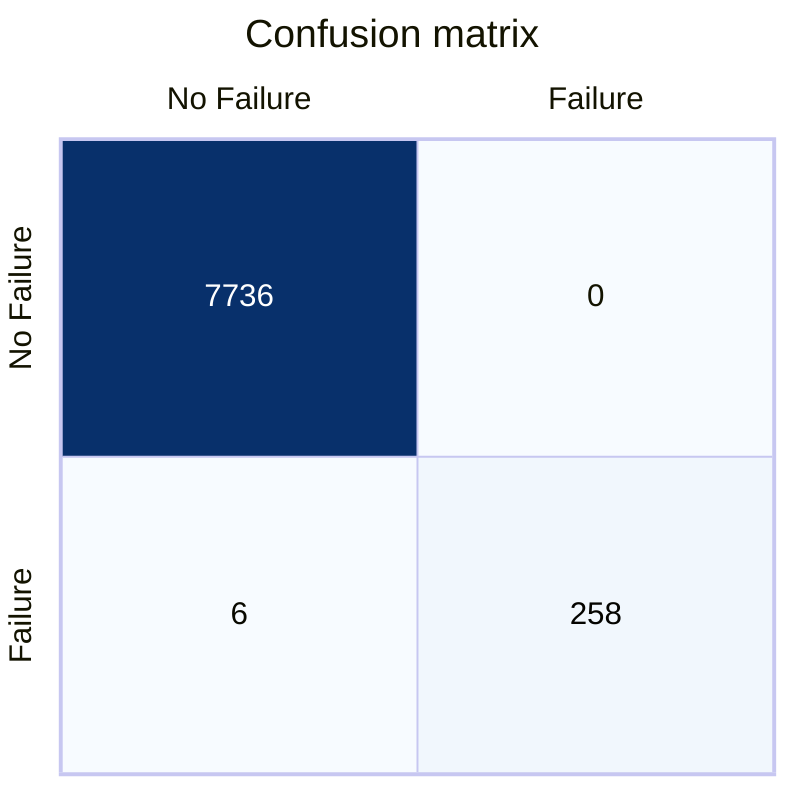
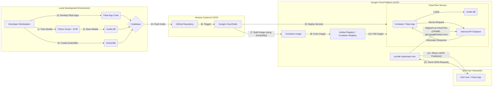
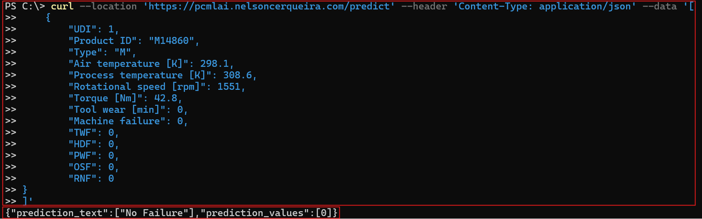

# PREDICTIVE MAINTENANCE
Capstone project for the Professional Certificate in Machine Learning and Artificial Intelligence from Imperial College London

- [PREDICTIVE MAINTENANCE](#predictive-maintenance)
  - [OVERVIEW](#overview)
  - [DATASET INFORMATION](#dataset-information)
  - [Data Preprocessing](#data-preprocessing)
  - [MODEL](#model)
  - [HYPERPARAMETER OPTIMISATION](#hyperparameter-optimisation)
    - [Process:](#process)
    - [Results:](#results)
  - [RESULTS](#results-1)
    - [Key Metrics:](#key-metrics)
    - [Confusion Matrix:](#confusion-matrix)
  - [HIGH LEVEL DIAGRAM AND CI/CD](#high-level-diagram-and-cicd)
  - [TESTING THE MODEL](#testing-the-model)
  - [REFERENCES](#references)


## OVERVIEW
This capstone project focuses on predictive maintenance within a Computer-Aided Facilities Management (CAFM) system. 

There are 3 main groups of maintenance: **Corrective maintenance** , also known as **reactive maintenance**, which requires intervention after a failure. **Preventive maintenance** can be scheduled based on time or usage, and **predictive maintenance** requires close monitoring of data from the CAFM solution and associated sensors.


## DATASET INFORMATION
Matzka (2020a) has created a Predictive Maintenance dataset comprising 10,000 datapoints with six features: 

- Product ID
- Air temperature
- process temperature
- rotational speed
- torque
- tool wear

**Dataset name**: AI4I 2020 Predictive Maintenance Dataset

**Date donated**: 8/29/2020 

**Source**: https://archive.ics.uci.edu/dataset/601/ai4i+2020+predictive+maintenance+dataset

**Has Missing Values?**: No

**Link to data sheet**: [data_sheet.md](data_sheet.md)

The dataset contains enough relevant data to train a model. CAFM relies on data from multiple sensors, and the dataset captures many of the relevant data sources expected in our environment. It will enable me to create an initial model that can assist in implementing predictive maintenance

## Data Preprocessing

The data was preprocessed in a pipeline as follows:

- **Handling missing Values:** Checkd and no missing values were found in the dataset.
- **Feature Engineering:** A corrolation matrix was ploted and relevant fetures were reduced to 4 (`TWF`, `HDF`, `PWF`, and `OSF`).- 
- **Feature Scaling:** All relevant features  were scaled between 0 and 1


## MODEL 
The chosen algorithm for this model was Support Vector Machines (SVM). The reason was that SVMs provide one of the best results for this type of data. For complex data SVMs combined with KNN (Amaury, Eduardo, & Beltrame, 2013), neural networks or decision trees (Cheng et al. 2020, p. 3) will also work well.

The data was split into 80% for trainning and 20% for testing.

**Link to model card**: [model_card.md](model_card.md)

## HYPERPARAMETER OPTIMISATION
The Support Vector Machine (SVM) classifier was chosen for its effectiveness in handling high-dimensional data and its ability to provide robust results for predictive maintenance tasks.

### Process:
1. **Kernel Selection**: Various kernels were tested, including:
   - `Linear`
   - `Polynomial (Poly)`
   - `Sigmoid`
   - `Radial Basis Function (RBF)`

2. **Hyperparameter Tuning**:
   - **C (Regularization Parameter)**: Controls the trade-off between achieving a low error on the training data and minimizing model complexity.
   - **Gamma**: Defines the influence of a single training example.
   - **coef0**: Used in polynomial and sigmoid kernels to control the influence of higher-order terms.

### Results:
After extensive testing, the `Linear` kernel with default hyperparameters provided the best performance:
- **C**: Default value
- **Gamma**: Default value
- **Accuracy**: `99.925%`

The simplicity of the linear kernel, combined with its high accuracy, made it the optimal choice for this dataset. Other kernels, such as RBF and Poly, did not significantly improve accuracy and added unnecessary complexity.

## RESULTS
The model achieved outstanding performance on the test dataset, demonstrating its effectiveness in predicting machine failures.

### Key Metrics:
- **Accuracy**: `99.925%`
- **Precision**: High precision for both `Failure` and `No Failure` classes.
- **Recall**: Near-perfect recall for the `No Failure` class, with minimal false negatives for the `Failure` class.

### Confusion Matrix:

The confusion matrix below illustrates the model's performance:



The model delivered a **99.925%** accuracy against the test data.

## HIGH LEVEL DIAGRAM AND CI/CD


**Note**: Please use the content of the folder named [cloud](cloud/) to create a all the required CI/CD pipeline and host your inference model in a cloud provider using a IaaS/PaaS configuration.

## TESTING THE MODEL

Calling the model from a automated script will be easy, bellow I provide a way to call it via **curl** but as long as you can send the data/doby a json format you can use anything like PHP, C#, Javascript, Python, Powershell, etc. 

```batch
curl --location 'https://pcmlai.nelsoncerqueira.com/predict' --header 'Content-Type: application/json' --data '[
    {
        "UDI": 1,
        "Product ID": "M14860",
        "Type": "M",
        "Air temperature [K]": 298.1,
        "Process temperature [K]": 308.6,
        "Rotational speed [rpm]": 1551,
        "Torque [Nm]": 42.8,
        "Tool wear [min]": 0,
        "Machine failure": 0,
        "TWF": 0,
        "HDF": 0,
        "PWF": 0,
        "OSF": 0,
        "RNF": 0
}
]'
```

Example of a API call to the inference server and a response with the predicted values:


**Note**: I've sent one single item but you can send multiple items as long as they are seperate json objects.

## REFERENCES
Amaury, A. B., Eduardo, B., & Beltrame, E. (2013). A COMBINATION OF SUPPORT VECTOR MACHINE AND K-NEAREST NEIGHBORS FOR MACHINE FAULT DETECTION. (T. &. Group, Ed.) Applied artificial intelligence 27.1, 36-49.

CHENG, J. C. P., CHEN, W., CHEN, K. & WANG, Q. 2020. Data-driven predictive maintenance planning framework for MEP components based on BIM and IoT using machine learning algorithms. Automation in Construction, 112, 103087.

MATZKA, S. 2020a. AI4I 2020 Predictive Maintenance Dataset. https://doi.org/10.24432/C5HS5C, submitted to UCI Machine Learning Repository, 2020.

MATZKA, S. Explainable Artificial Intelligence for Predictive Maintenance Applications.  2020 Third International Conference on Artificial Intelligence for Industries (AI4I), 21-23 Sept. 2020 2020b. 69-74.

