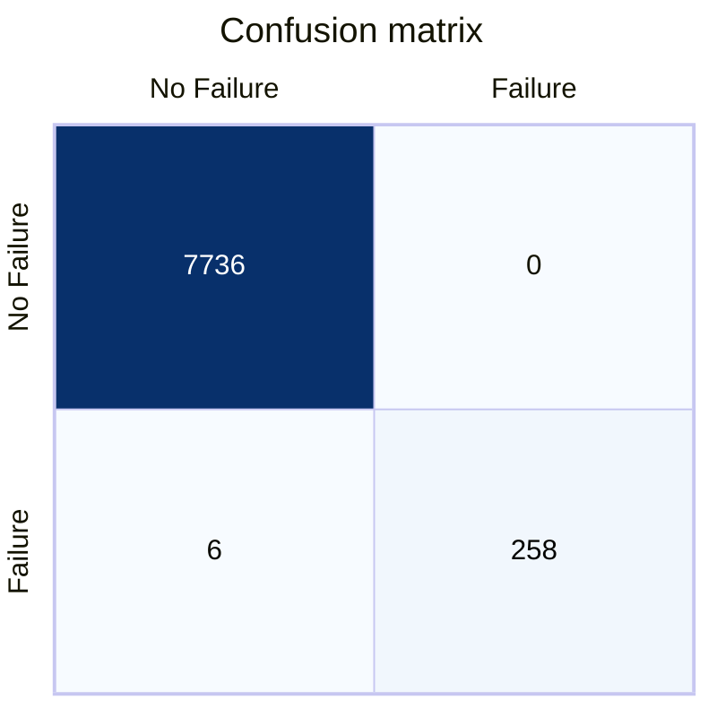

# PREDICTIVE MAINTENANCE
Capstone project for the Professional Certificate in Machine Learning and Artificial Intelligence from Imperial College London

## OVERVIEW
This capstone project focuses on predictive maintenance within a Computer-Aided Facilities Management (CAFM) system. 

There are 3 main groups of maintenance: **Corrective maintenance** , also known as **reactive maintenance**, which requires intervention after a failure. **Preventive maintenance** can be scheduled based on time or usage, and **predictive maintenance** requires close monitoring of data from the CAFM solution and associated sensors.

## DATASET INFORMATION
Matzka (2020a) has created a Predictive Maintenance dataset comprising 10,000 datapoints with six features: Product ID, Air temperature, process temperature, rotational speed, torque, and tool wear (Matzka, 2020b)

The dataset contains enough relevant data to train a model. CAFM relies on data from multiple sensors, and the dataset captures many of the relevant data sources expected in our environment. It will enable me to create an initial model that can assist in implementing predictive maintenance

## MODEL 
The chosen algorithm for this model was Support Vector Machines (SVM). The reason was that SVMs provide one of the best results for this type of data. For complex data SVMs combined with KNN (Amaury, Eduardo, & Beltrame, 2013), neural networks or decision trees (Cheng et al. 2020, p. 3) will also work well.

## HYPERPARAMETER OPTIMSATION
SVMs are well defined in the Python SciKit-learn package, which offers a multitude of hyperparameters to fine-tune the model.

I tried a few kernels "**Linear**", "**Poly**", "**Sigmoid**" and "**RBF**", with different **gammas, C and coef0** but in the end the default values for the **linear Kernel** delivered the best results with **99.925%** accuracy. 

## RESULTS

## (OPTIONAL: CONTACT DETAILS)
If you are planning on making your github repo public you may wish to include some contact information such as a link to your twitter or an email address. 

## REFERENCES
Amaury, A. B., Eduardo, B., & Beltrame, E. (2013). A COMBINATION OF SUPPORT VECTOR MACHINE AND K-NEAREST NEIGHBORS FOR MACHINE FAULT DETECTION. (T. &. Group, Ed.) Applied artificial intelligence 27.1, 36-49.

CHENG, J. C. P., CHEN, W., CHEN, K. & WANG, Q. 2020. Data-driven predictive maintenance planning framework for MEP components based on BIM and IoT using machine learning algorithms. Automation in Construction, 112, 103087.

MATZKA, S. 2020a. AI4I 2020 Predictive Maintenance Dataset. https://doi.org/10.24432/C5HS5C, submitted to UCI Machine Learning Repository, 2020.

MATZKA, S. Explainable Artificial Intelligence for Predictive Maintenance Applications.  2020 Third International Conference on Artificial Intelligence for Industries (AI4I), 21-23 Sept. 2020 2020b. 69-74.

